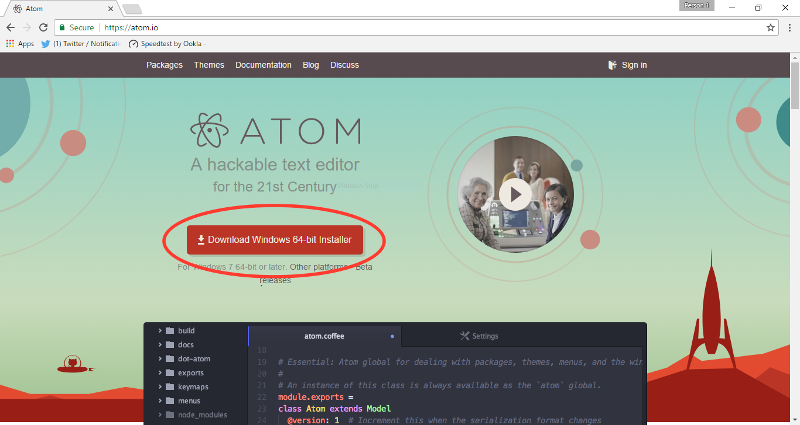

# Lesson 1 - Introduction to HTML

## Course Introduction
Welcome to Moringa School's computer club curriculum. By the end of the term, you will be able to build a simple website using HTML and CSS.

This course is a bit different from others you may have taken before in that it is a self-taught class. There are no lectures or homework, and your teacher may not be an expert in web development.

All of the information you need to build your web development skills is available to you in this guide. That's not to say that you won't have questions -- in fact, it's very important that you ask questions! But those questions usually won't be directed at your teacher. Instead, you'll ask other students for help, and you'll learn about specific online resources to answer your questions and further your learning.

One other thing to know about self-teaching is that you will learn in proportion to how much effort you put into learning. For example, in a few minutes you'll be tasked with typing up some code provided below. It may be tempting to copy and paste, but you'll learn much faster if you take the time to type the code yourself. If you copy and paste, you'll only learn theoretically. But if you type it yourself, your fingers will get used to the feeling of typing code, you'll have a much deeper understanding of what the code actually means, and you'll come away with practical skills.

## Lesson Introduction
Today we'll learn how to make a simple website using HTML, with a hands on, learn by doing approach.

Turn to a partner and answer the following questions:
- Why do you want to learn to code? Maybe to create a business, game, or provide information about your place of worship.
- Have you ever tried to learn to code before? If so, what was that experience like?

## Installation
Before we can write code, we need an appropriate text editor. Microsoft Word is great for writing a paper, but features like spell check would get in the way of writing code.

Let's start by installing a text editor made for coding called Atom.

1. Go to [http://www.atom.io](http://www.atom.io) and click the Download button.

1. If a security prompt is shown, allow the download to continue by clicking on `Keep`.

1. When the download has completed, click on the `.exe` file to open Atom. It will take a few minutes to install.

1. Once it's done installing, Atom will open with some default tabs. Go ahead and close those by moving your mouse over each tab and clicking the `x` that shows up on the right.


## Hello, world!
Let's jump in to making your first web page. Create a new tab in Atom by pressing `ctrl+n`. You should now see a tab that says `untitled`.


Type in `Hello, world!` and save by pressing `ctrl+s`. Name the file `hello-world.html` and save it on the Desktop so it's easy to find.


 Once you've saved, find the file on your Desktop and double click it to open it in your browser.

 

Congratulations, you've just made your first web page! Pretty cool, right?

## Tags and Elements

Now that we have the basic flow of creating a file, saving it, and opening the file in the browser, let's learn some HTML.

Make a new file and start by typing this code in. Don't copy and paste! You'll learn much faster by typing everything yourself.

``` html
<!DOCTYPE html>
<html>
	<head>
		<title>Lesson 1</title>
	</head>
	<body>
		<h1>Lesson 1</h1>
		<h2>Intro to HTML</h2>
		<p>I'm learning HTML!</p>
	</body>
</html>
```
Go ahead and save (`ctrl+s`) and name this file `lesson1.html`. Open it up in the browser and see what we've made!


HTML is structured by *tags*. A tag is written between angle brackets, like `<title>`. You'll notice each *starting tag* has a corresponding *closing tag*, for example `<title>` and `</title>`. The starting tag, closing tag, and all the content between them together make up an *element*, so `<title>Lesson 1</title>` is the `title` element.

Let's see what each tag does line by line.

- `<!DOCTYPE html>` is a special tag that tells the browser what language to interpret this document in. It's the only tag that's allowed to be outside of the `html` element.

- `<html>` contains all the HTML of the document. It is always split up into a `head` element and a `body` element.

- `<head>` contains information that doesn't appear on the webpage itself.

- `<title>` contains the title shown at the top of your browser.

- `<body>` contains the main content of your page. Most of our HTML will be written in here.

- `<h1>` is a big heading. It often matches the title.

- `<h2>` is a subheading, like `h1` but smaller. HTML has 6 levels of headings (up to `h6`) that get smaller and smaller.

- `<p>` is a paragraph.

HTML might look a little confusing at first, but as you practice coding you’ll be able to read HTML just like you read English.

Notice the indentation in your HTML document. Is it left-aligned, or is it indented like the example above, with nested elements starting a new level of indentation? (A nested element is an element that’s contained within another element, like `title` is nested within `head`, which is nested within `html`.)

Proper indentation is important because it makes the code easier to read. With proper indentation, you (or someone else reading your code) can visually scan down the left side and easily see, for example, what’s in the `body` element.

If your code isn’t indented already properly, do that now. Every new line after an open tag should have an additional level of indentation.

Coders learn by doing. Take a minute to play around with these elements. Try changing the title to say `Welcome!`. Then add another subheading (`<h2>`) at the end of the `body` element (just above the `</body>` closing tag) that says `Author` and a paragraph (`<p>`) with your name.

## Take a Break
It's important to take care of your body. Sitting and looking at a computer screen for too long can be detrimental to your health.

Stand up, look away from the screen, and stretch for a minute.

## What is HTML anyway?

HTML stands for HyperText Markup Language. HyperText just means we can link to other web pages, and Markup means it provides additional instructions to the content (using tags) to make it more than just plain text.

Every website is created with HTML. It provides the structure of a web page. You'll notice it looks pretty plain. Don't worry, we'll get to styling it with CSS later.

## Lists
Often websites have lists of things, for example a news website might have news categories to choose from or a recipe site might have a list of steps to follow.


Let's add some lists to our page. At the bottom of the `body` element (again, just before the `</body>` closing tag), type in the following and see what it does.
``` html
<h2>Lists</h2>
<h3>Favorite Animals</h3>
<ul>
	<li>Lion</li>
	<li>Tiger</li>
	<li>Giraffe</li>
	<li>Elephant</li>
</ul>
```

Let's take a look at the new tags.

- The "UL" in `<ul>` stands for unordered list. This creates a list that is populated by `<li>`s.
- `<li>` stands for list item.

In addition to unordered lists, we can create ordered lists with `<ol>`. It works similarly to `ul` in that it contains `li` elements, but `ol` automatically labels the list items with numbers.

Below the `ul` element, make another `h3` heading called `Favorite Colors`, and list your top 3 favorite colors using `ol` and `li`.


## Coding time
Now that you've learned a bit of HTML, let's put that into practice by making a custom website. It can be a website about you, a business idea, your favorite musician... anything you like!

Start with a new file and write everything from scratch. Try and use as many of the different elements we've learned today. It's perfectly fine to look at the code you've just written for reference, but resist the urge to copy and paste!

## Wrapping up
That's all for now. In this lesson, we created our first web page using HTML.

Find a partner and take a minute to answer the following questions together. If you’re not sure about your answer, discuss it with another group.

- What's the difference between a tag and an element?
- What are the two parts of every `html` element?
- What's the keyboard shortcut to save a file?
- Think about some websites you’ve seen. What features would you like to be able to add to your own site?
